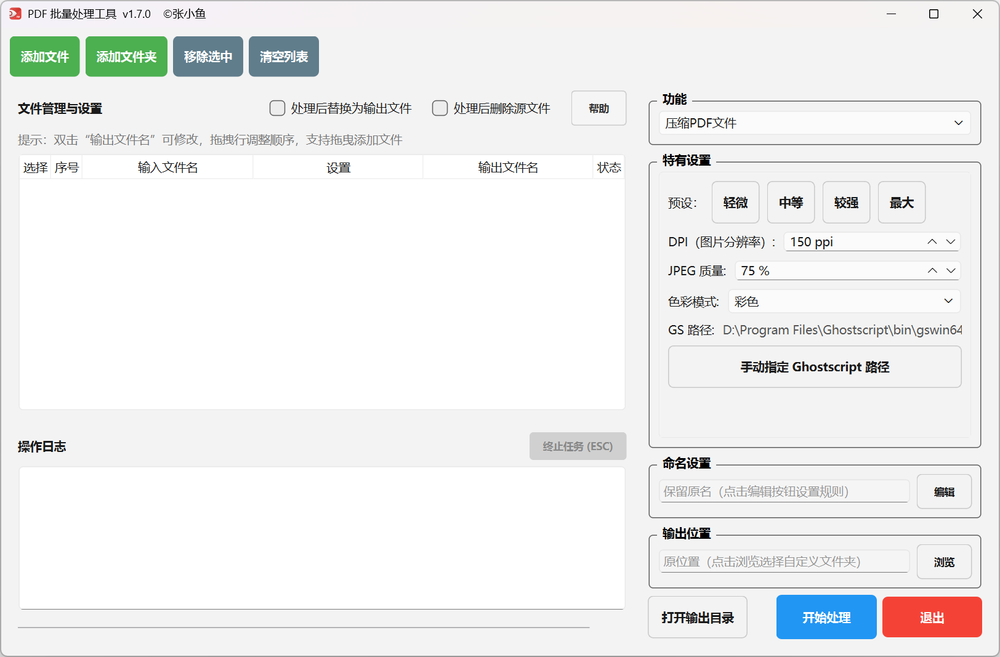
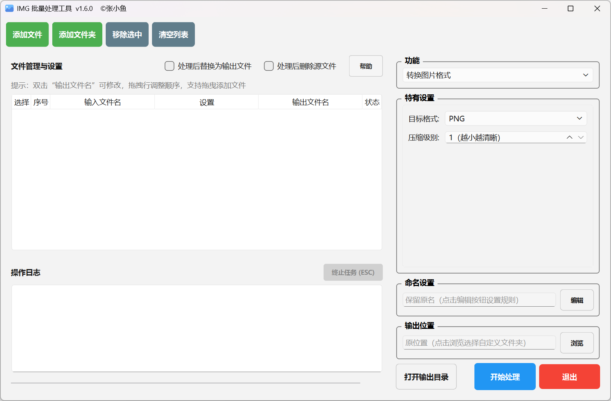
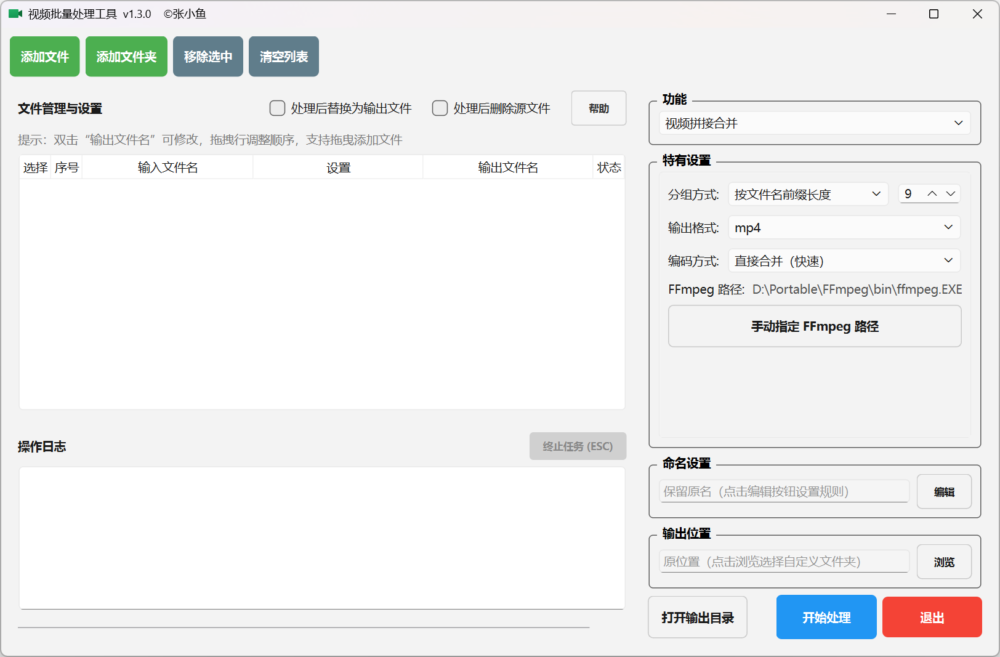

# PDF + 图片+视频批量处理工具

基于 Python 的 PDF、图片、视频批量处理工具，所有操作在本地完成，无需上传文件。软件为便携版，免安装，不修改系统注册表，解压即用。

下载对应的 ZIP 压缩包，解压后双击内部的 .exe 文件即可启动（Windows 系统）。如遇杀毒软件误报，添加信任或暂时关闭实时保护即可（PyInstaller 打包属于常见误报情况）。

| 序号 | 工具             | 功能说明                                                                                                                                                                                                                                                                                                                                                                                                                  |
| ---- | ---------------- | ------------------------------------------------------------------------------------------------------------------------------------------------------------------------------------------------------------------------------------------------------------------------------------------------------------------------------------------------------------------------------------------------------------------------- |
| 1    | PDF 批量处理工具 | ● 压缩 PDF 文件：降低文件体积，支持预设和手动调节 ● PDF 格式转换：与其他格式互转，依赖 Office 或 LibreOffice ● 合并 PDF 页面：多个 PDF 合并为一个，支持分组合并 ● 组织 PDF 页面：提取 / 插入 / 拆分 / 重排 / 删除页面 ● PDF 添加书签：手动添加书签或自动生成目录 ● 调整 PDF 尺寸：统一页面大小，支持 A0-A6 / Letter / Legal / 自定义 ● PDF 转扫描效果：模拟扫描件外观，支持发黄、噪点、模糊等调节 |
| 2    | 图片批量处理工具 | ● 压缩图片文件：减小体积，支持预设 / 灰度 / 缩放，GIF 支持抽帧 ● 转换图片格式：格式互转，支持 PNG / JPG / WEBP / BMP / TIFF / GIF / ICO ● 多图合成 GIF：自定义帧间隔和循环次数 ● 动图拼接合并：拼接多张 GIF 图片，支持顺序播放和同时播放 ● 静图拼接合并：垂直 / 水平 / 网格 / 台词拼接 ● 调整图片大小：修改分辨率，支持像素 / 百分比 / 边约束 ● 图片分切裁剪：水平 / 垂直 / 网格切割              |
| 3    | 视频批量处理工具 | ● 视频片段截取：按开始 / 结束时间截取视频片段 ● 视频转 GIF：将视频片段转为 GIF，可调帧率、尺寸、颜色数 ● 视频拼接合并：多个视频合并为一个，支持直接合并或重新编码                                                                                                                                                                                                                                                      |

本项目基于 AGPL-3.0 许可证开源，代码部分由 AI 协助完成，维护能力有限，不保证长期持续更新。

© 张小鱼（Aria）· contact@arianote.top
